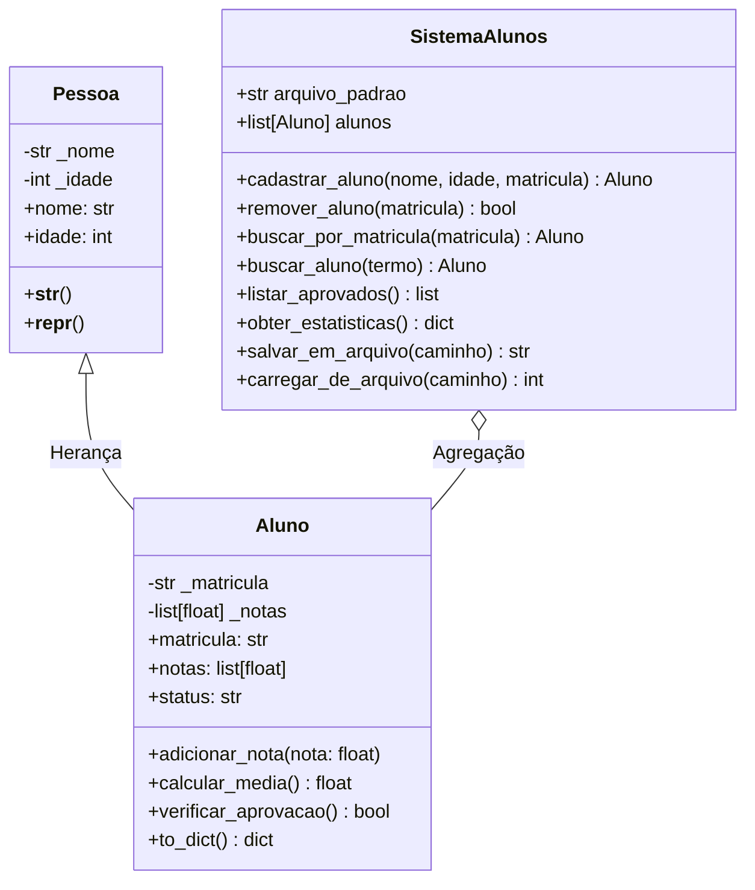

# 📚 Sistema de Gestão e Cadastro de Alunos

[](https://www.python.org/)
[](https://docs.pytest.org/)
[]()
[]()

Aplicação em **Python** desenvolvida com foco em boas práticas de Engenharia de Software, Programação Orientada a Objetos (POO) idiomática, tratamento defensivo de exceções e persistência de dados em JSON.

Projeto estruturado para demonstrar domínio de arquitetura limpa, separação de responsabilidades, testes unitários/integração automatizados e experiência de console (CLI) resiliente.

---

## 🚀 Principais Funcionalidades

- **CRUD Completo de Alunos**: Cadastro com garantia de unicidade de matrícula, busca por matrícula exata ou nome parcial, remoção com confirmação e listagem geral.
- **Gestão Acadêmica e Boletim**: Lançamento de notas com validação de faixa (0.0 a 10.0), cálculo automático de média ponderada e verificação do status acadêmico (*Aprovado* $\ge$ 6.0 ou *Reprovado*).
- **Painel Analítico da Turma**: Média geral da turma, taxa percentual de aprovação e contagem consolidada de alunos aprovados e reprovados.
- **Persistência Segura & Auto-Save**: Salvamento automático e atômico em JSON após operações críticas, evitando perda de dados por fechamento inadvertido ou `Ctrl+C`.
- **CLI Resiliente (Zero Crash)**: Captura e higienização de todas as entradas do usuário, impedindo quebras por `ValueError` em números inteiros ou decimais.

---

## 🏛️ Arquitetura e Decisões de Design

O projeto adota os pilares fundamentais da Orientação a Objetos no estilo pythônico:



### Destaques Técnicos:
1. **Encapsulamento com `@property`**: Substituição de getters manuais no estilo Java por propriedades idiomáticas do Python com validações defensivas nos setters.
2. **Imutabilidade de Exposição**: O atributo `notas` de `Aluno` retorna uma cópia rasa (`list(self._notas)`), impedindo que código externo altere a lista diretamente sem passar pelas validações de `adicionar_nota()`.
3. **Exceções de Domínio Especializadas**: Módulo `exceptions.py` contendo uma hierarquia semântica de erros (`MatriculaInvalidaError`, `NotaInvalidaError`, `AlunoDuplicadoError`).

---

## 📂 Estrutura do Projeto

```text
Sistema de Cadastro de Alunos/
├── exceptions.py         # Hierarquia de erros de domínio
├── pessoa.py             # Classe base Pessoa com validações de atributos
├── aluno.py              # Classe Aluno herdando de Pessoa e regras acadêmicas
├── sistema.py            # Orquestrador do sistema, métricas e persistência JSON
├── main.py               # Interface de Linha de Comando (CLI) resiliente
├── pytest.ini            # Configuração do framework de testes
├── requirements.txt      # Dependências para execução dos testes
└── tests/
    ├── __init__.py
    ├── test_models.py    # Testes unitários para Pessoa e Aluno
    └── test_sistema.py   # Testes de integração (CRUD, métricas, JSON)
```

---

## 🛠️ Como Executar a Aplicação

### Pré-requisitos
* Python 3.10 ou superior instalado.

### 1. Clonar ou Acessar o Diretório
```bash
cd "Sistema de Cadastro de Alunos"
```

### 2. Iniciar o Sistema
```bash
python main.py
```

---

## 🧪 Execução dos Testes Automatizados

O projeto conta com **22 testes automatizados** cobrindo cenários de sucesso, casos de borda e entradas maliciosas ou inválidas.

```bash
# Instalar pytest (se ainda não possuir)
pip install -r requirements.txt

# Executar a suíte de testes completa
python -m pytest
```

Saída esperada:
```text
tests/test_models.py ...........                                         [ 50%]
tests/test_sistema.py ...........                                        [100%]

============================= 22 passed in 0.06s ==============================
```

---

## 🗺️ Roadmap de Evolução Futura

- [ ] **Interface Web / REST API**: Exposição dos serviços com `FastAPI` e documentação Swagger automática.
- [ ] **Persistência Relacional**: Suporte opcional a banco de dados `SQLite` com `SQLAlchemy`.
- [ ] **Múltiplas Disciplinas**: Associação de notas a matérias curriculares individuais (ex: Matemática, História).
- [ ] **Exportação de Relatórios**: Geração de relatórios de desempenho da turma em formato CSV e PDF.

---

## 👤 Autor
Desenvolvido como projeto de portfólio para demonstrar padrões de arquitetura, POO e código limpo em Python.
